# ProxMorph Theme Gallery

Complete gallery of all available ProxMorph themes for Proxmox VE and PBS.

**Quick Links:** [Installation](README.md#-installation) | [Creating Themes](README.md#-creating-themes) | [Troubleshooting](README.md#-troubleshooting)

---

## Catppuccin Collection

Soothing pastel themes based on the [Catppuccin](https://github.com/catppuccin/catppuccin) color palette.

<table>
  <tr>
    <td width="50%" align="center">
      <h3>Catppuccin Mocha</h3>
      
       
      <i>Darkest Catppuccin flavor — deep warm tones with mauve accent</i>
    </td>
    <td width="50%" align="center">
      <h3>Catppuccin Mocha Teal</h3>
      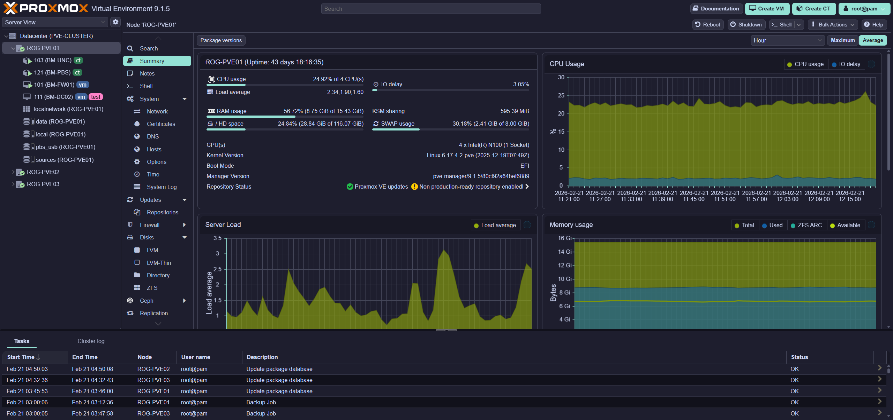
       
      <i>Mocha palette with teal accent</i>
    </td>
  </tr>
  <tr>
    <td width="50%" align="center">
      <h3>Catppuccin Macchiato</h3>
      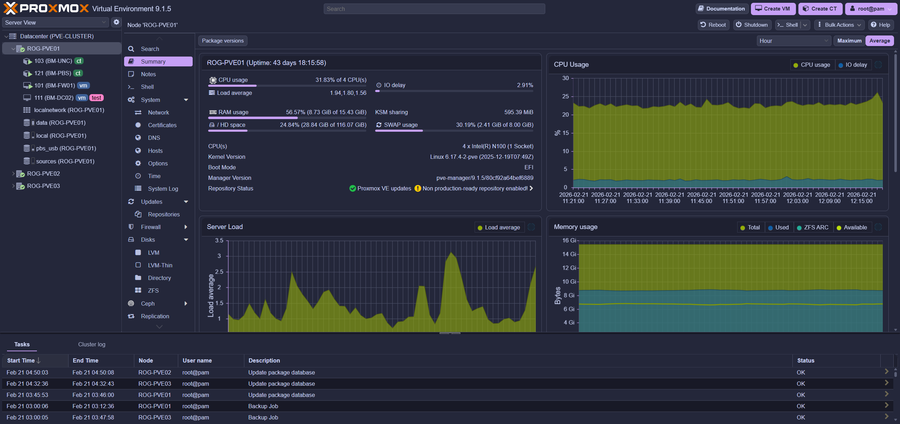
       
      <i>Mid-dark Catppuccin flavor with blue-tinted base</i>
    </td>
    <td width="50%" align="center">
      <h3>Catppuccin Frappé</h3>
      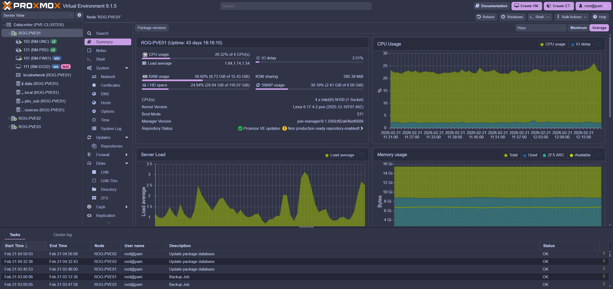
       
      <i>Lightest dark Catppuccin flavor with muted blue base</i>
    </td>
  </tr>
  <tr>
    <td width="50%" align="center">
      <h3>Catppuccin Latte</h3>
      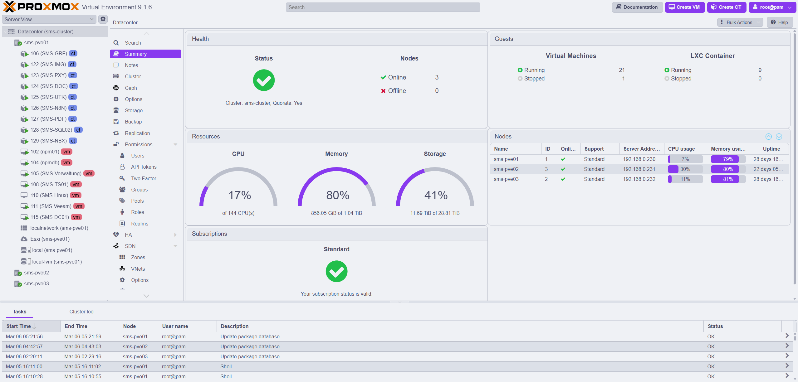
       
      <i>Official light variant — warm off-white with purple accent</i>
    </td>
    <td width="50%"></td>
  </tr>
</table>

---

## Dracula Collection

Dark themes based on the iconic [Dracula](https://draculatheme.com/) color scheme.

<table>
  <tr>
    <td width="50%" align="center">
      <h3>Dracula</h3>
      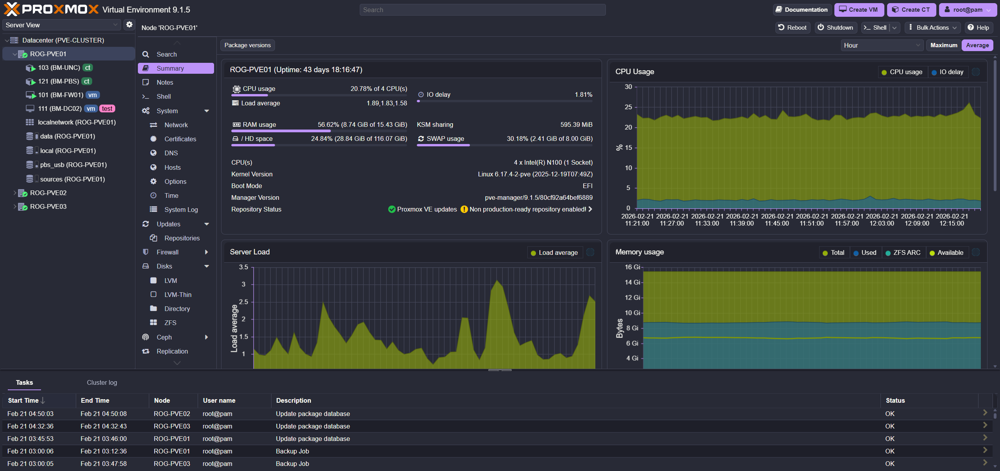
       
      <i>Classic Dracula dark with purple accent</i>
    </td>
    <td width="50%" align="center">
      <h3>Dracula Midnight</h3>
      
       
      <i>Near-black backgrounds from the Dracula UI spec</i>
    </td>
  </tr>
  <tr>
    <td width="50%" align="center">
      <h3>Dracula Pink</h3>
      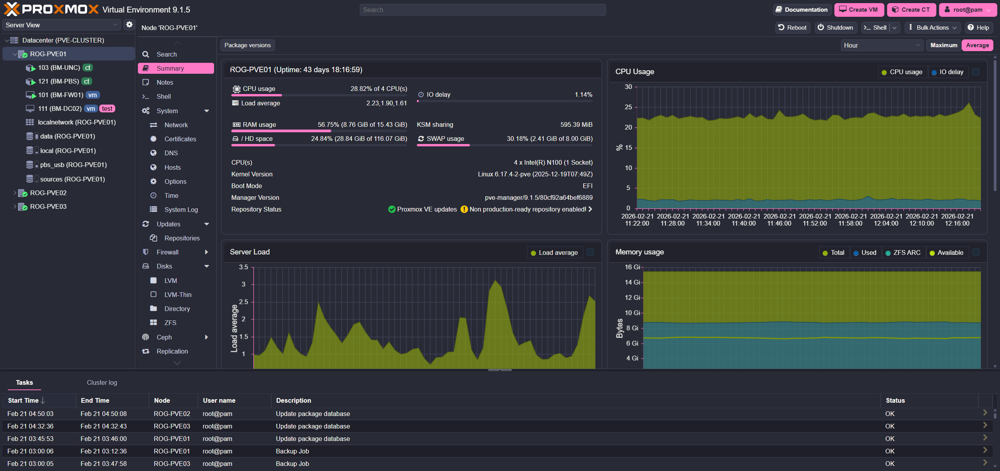
       
      <i>Dracula palette with pink accent</i>
    </td>
    <td width="50%" align="center">
      <h3>Dracula Cyan</h3>
      
       
      <i>Dracula palette with cyan accent</i>
    </td>
  </tr>
  <tr>
    <td width="50%" align="center">
      <h3>Dracula Green</h3>
      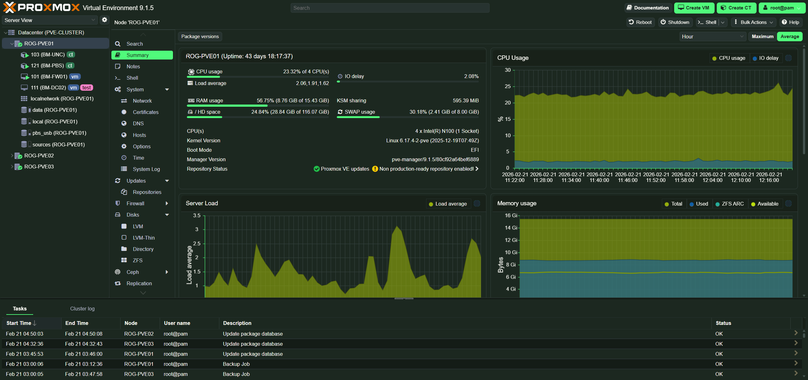
       
      <i>Forest-tinted backgrounds with green accent</i>
    </td>
    <td width="50%" align="center">
      <h3>Dracula Orange</h3>
      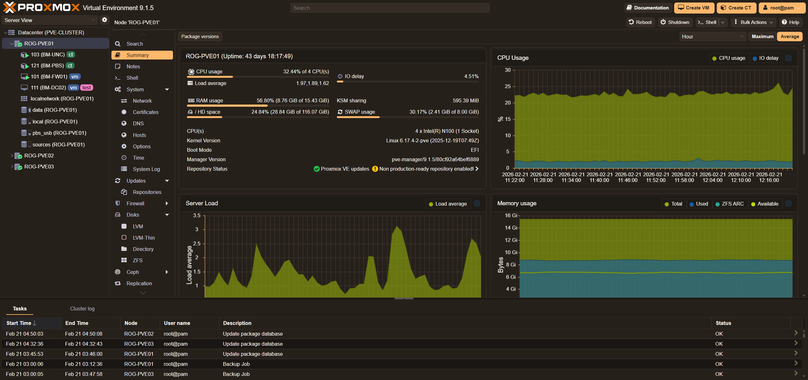
       
      <i>Warm-tinted backgrounds with orange accent</i>
    </td>
  </tr>
</table>

---

## Nord Collection

Arctic, bluish-cold themes based on the [Nord](https://www.nordtheme.com/) color palette.

<table>
  <tr>
    <td width="50%" align="center">
      <h3>Nord Dark</h3>
      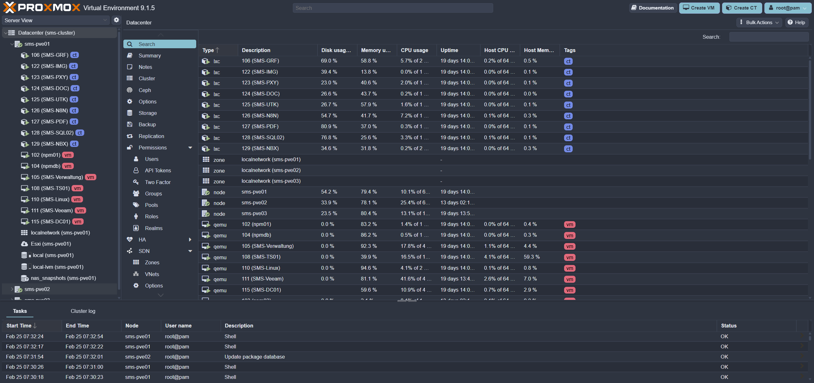
       
      <i>Arctic dark palette with polar blue accent</i>
    </td>
    <td width="50%" align="center">
      <h3>Nord Light</h3>
      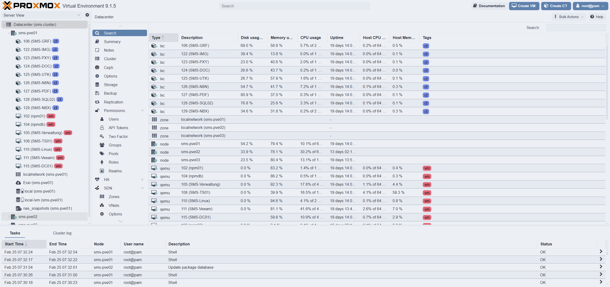
       
      <i>Snow-bright variant with frost blue tones</i>
    </td>
  </tr>
</table>

---

## Gruvbox Collection

Retro groove themes based on the warm [Gruvbox](https://github.com/morhetz/gruvbox) palette.

<table>
  <tr>
    <td width="50%" align="center">
      <h3>Gruvbox Dark</h3>
      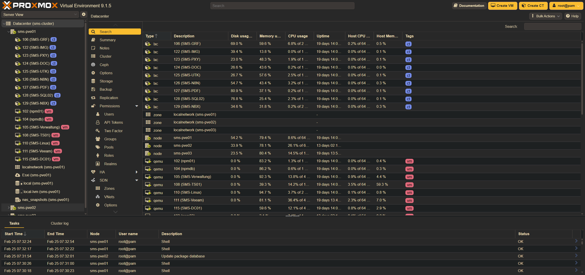
       
      <i>Warm retro groove colors with yellow accent</i>
    </td>
    <td width="50%" align="center">
      <h3>Gruvbox Light</h3>
      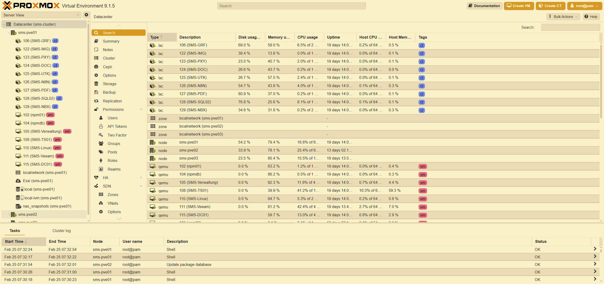
       
      <i>Soft sepia variant with earthy tones</i>
    </td>
  </tr>
</table>

---

## Solarized Collection

Precision colors designed for machines and humans, based on [Solarized](https://ethanschoonover.com/solarized/).

<table>
  <tr>
    <td width="50%" align="center">
      <h3>Solarized Dark</h3>
      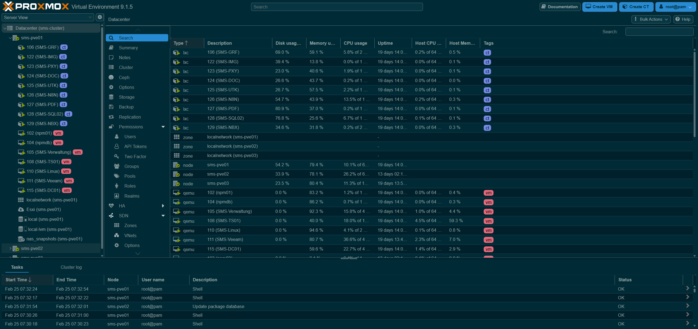
       
      <i>Dark variant with cyan/blue accent</i>
    </td>
    <td width="50%" align="center">
      <h3>Solarized Light</h3>
      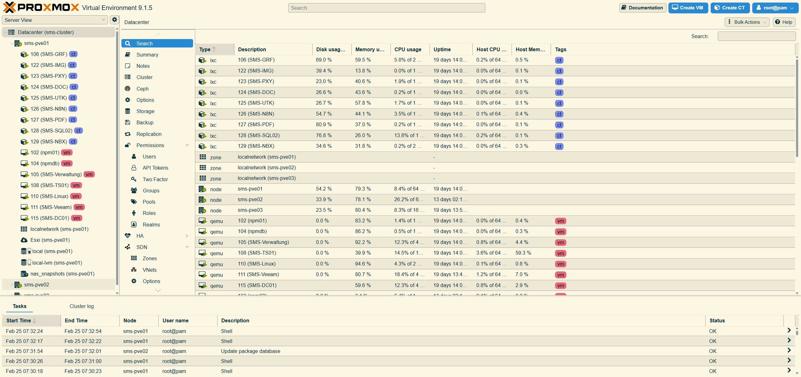
       
      <i>Cream-colored light variant</i>
    </td>
  </tr>
</table>

---

## Tokyo Night

<table>
  <tr>
    <td width="50%" align="center">
      <h3>Tokyo Night</h3>
      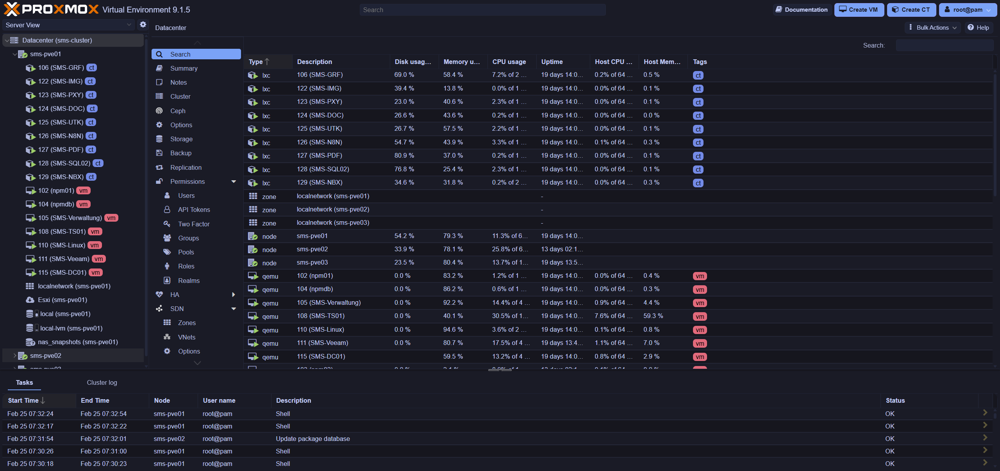
       
      <i>Dark theme inspired by Tokyo's neon lights</i>
    </td>
    <td width="50%"></td>
  </tr>
</table>

---

## Other Themes

<table>
  <tr>
    <td width="50%" align="center">
      <h3>UniFi</h3>
      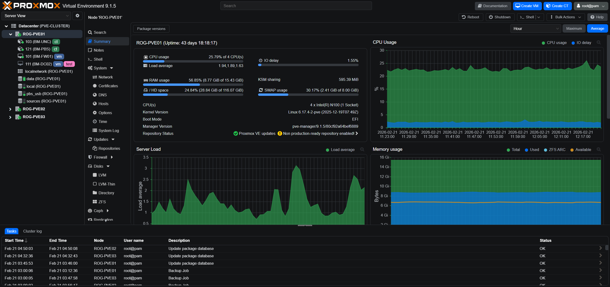
       
      <i>Inspired by Ubiquiti UniFi Network Application</i>
    </td>
    <td width="50%" align="center">
      <h3>GitHub Dark</h3>
      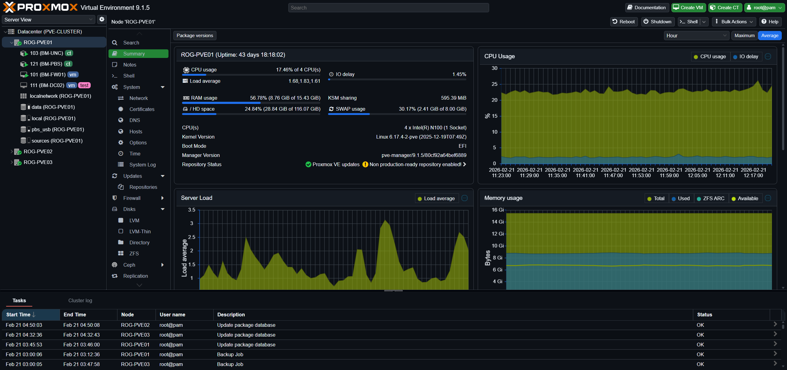
       
      <i>Based on GitHub Dark Dimmed theme</i>
    </td>
  </tr>
  <tr>
    <td width="50%" align="center">
      <h3>Blue Slate</h3>
      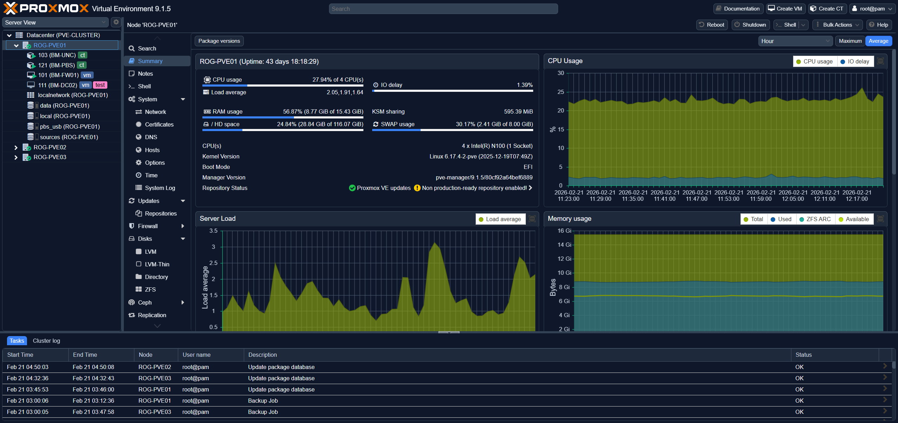
       
      <i>Cool blue-gray tones with slate accent</i>
    </td>
    <td width="50%"></td>
  </tr>
</table>

---

## Contributing Themes

Want to add your own theme? See the [Creating Themes](README.md#-creating-themes) section in the README.

New theme contributions are welcome via Pull Request!
